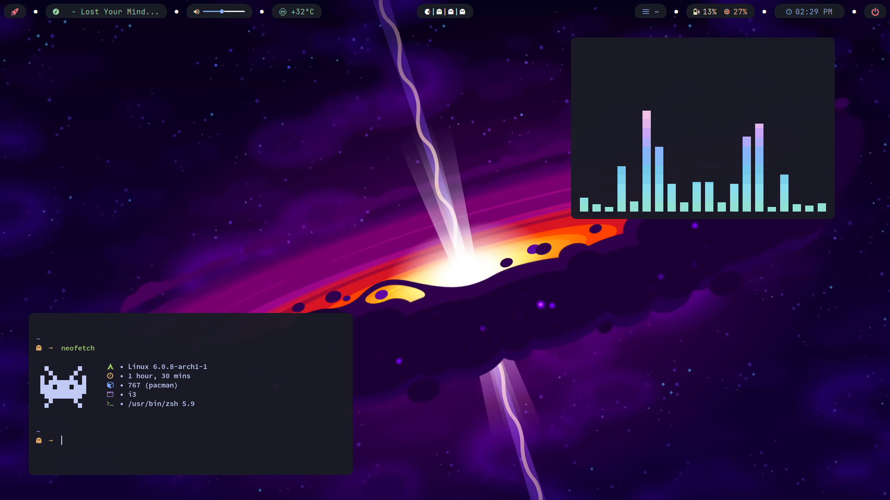
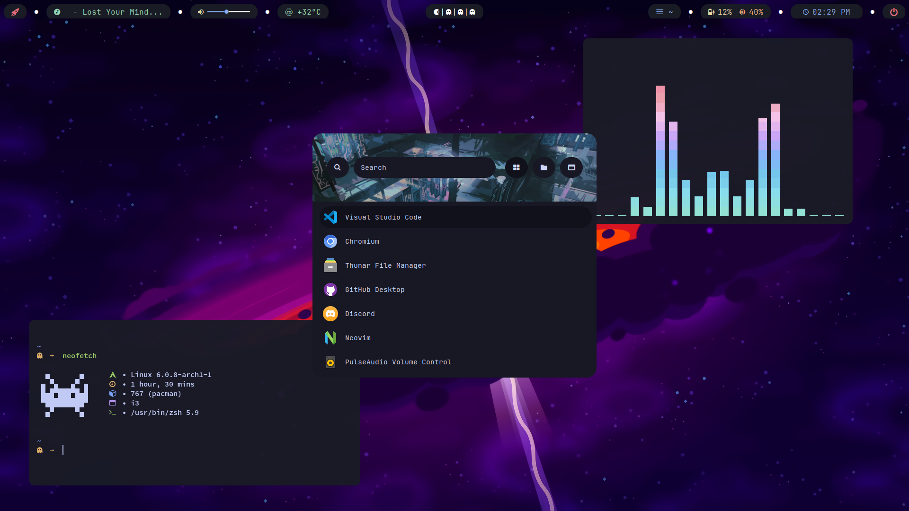
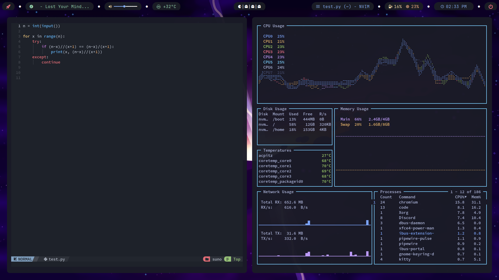

<h2 align="center"> ━━━━━━  ❖  ━━━━━━ </h2>

## 🌿 INFORMATION
- Window Manager (WM): `i3`
- Shell: `zsh` 
- Terminal: `kitty`
- Compositor: `pijulius/picom`
- Bar: `Polybar`
- Browser: `Brave`
- Editor: `neovim`
- Application Launcher: `rofi`
- Notification Manager: `dunst`
- File Manager: `lf`, `thunar`

## 📷 SHOWCASE

 
 ## 🎉 CREDITS
 - [craftzdog](https://github.com/NvChad/NvChad) - Neovim
 - [Boku](https://github.com/Spaxly/BSPWM-Config) -Bar
 <!-- - [HynDuf7](https://github.com/HynDuf7/dotfiles) - Colors -->
 <!-- - [VnPower](https://codeberg.org/VnPower/dotfiles) - His dotfile helpful most -->

 - [porudev](https://github.com/porudev) - I admired him
 

 

   

 
